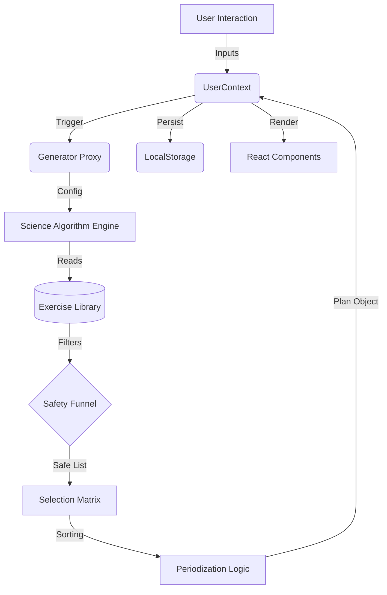

# DailyBurn - Comprehensive Technical Documentation

**Version:** 1.0.0
**Date:** February 4, 2026
**Author:** Naveen Akalanka
**Classification:** Internal Technical Reference

---

## Table of Contents

1.  [Executive Summary](#1-executive-summary)
2.  [Scientific Principles](#2-scientific-principles)
3.  [System Architecture](#3-system-architecture)
4.  [The Science Engine (Algorithm Deep Dive)](#4-the-science-engine-algorithm-deep-dive)
    *   [4.1 The Safety Funnel](#41-the-safety-funnel)
    *   [4.2 Periodization Logic](#42-periodization-logic)
    *   [4.3 Dynamic Volume Regulation](#43-dynamic-volume-regulation)
    *   [4.4 Boss Battles & Gamification](#44-boss-battles--gamification)
5.  [Data Structures & Schema](#5-data-structures--schema)
6.  [Component Architecture](#6-component-architecture)
7.  [State Management & Persistence](#7-state-management--persistence)
8.  [Mobile Integration (Capacitor)](#8-mobile-integration-capacitor)
9.  [Deployment Pipeline](#9-deployment-pipeline)
10. [Troubleshooting & Maintenance](#10-troubleshooting--maintenance)

---

## 1. Executive Summary

**DailyBurn** is a "Science-First" Progressive Web Application (PWA) designed to democratize elite-level sports science for the general public. Unlike the majority of fitness applications that rely on random exercise selection or "AI" generation (which often suffers from hallucinations and physiological invalidity), DailyBurn employs a **Deterministic Physiological Algorithm**.

The system generates personalized calisthenics (bodyweight) workout plans based on a user's specific constraints (time, equipment, injury history, and fitness level). It uniquely integrates **Undulating Periodization**—alternating between different biological energy systems—to ensure holistic athletic development rather than simple calorie burning.

This document serves as the definitive technical reference for the codebase, architecture, and underlying logic of the DailyBurn platform.

---

## 2. Scientific Principles

To understand the code, one must first understand the physiology that drives the logic. The application is built upon three core pillars of sports science:

### 2.1 The 3 Energy Systems (The Fuel Tanks)
The human body does not use a single fuel source. It uses three distinct pathways, and a complete athlete must train all of them. DailyBurn's scheduler automatically cycles through these systems:

1.  **Phosphagen System (ATP-CP):**
    *   **Focus:** Maximum Power, Explosiveness.
    *   **Duration:** 1-10 seconds.
    *   **Code Mapping:** Exercises with `sub_pattern: "Explosive"` or `"Power"`. High rest intervals.
    *   **UI Color:** Yellow (`ring-yellow-500`).

2.  **Glycolytic System (Anaerobic Lactic):**
    *   **Focus:** Hypertrophy, High-Intensity Sustained Effort.
    *   **Duration:** 30 seconds - 2 minutes.
    *   **Code Mapping:** Time Under Tension (TUT), controlled reps.
    *   **UI Color:** Orange (`ring-orange-500`).

3.  **Oxidative System (Aerobic):**
    *   **Focus:** Endurance, Recovery, Heart Health.
    *   **Duration:** Continuous.
    *   **Code Mapping:** Circuit training, lower rest, high volume.
    *   **UI Color:** Green or Blue (`ring-blue-500`).

### 2.2 The S.A.I.D. Principle
**Specific Adaptation to Imposed Demands.** The body adapts exactly to what it is forced to do.
*   *Application:* If a user inputs "30 minutes", the generator does not simply cut a 60-minute workout in half. It restructures the **density** of the workout (switching from standard sets to circuits) to maximize the specific adaptation possible within that time window.

### 2.3 Progressive Overload
The gradual increase of stress placed upon the body.
*   *Application:* The "Boss Battle" mechanic introduces a micro-spike in intensity at the end of sessions, forcing the user to test their limits against a harder progression variant (e.g., attempting a Diamond Pushup after mastering standard Pushups).

---

## 3. System Architecture

DailyBurn follows a **Monolithic Frontend Architecture** designed for offline-first capability and zero-latency interaction.

### 3.1 Tech Stack
*   **Runtime:** Browser (V8 Engine) / WebView (Android/iOS)
*   **Framework:** React 18 (Functional Components)
*   **Build System:** Vite (ESBuild based, <300ms HMR)
*   **Language:** JavaScript (ES6+)
*   **Styling:** Tailwind CSS v3 (Utility-first)
*   **Native Bridge:** Capacitor v6.0
*   **State:** React Context API + LocalStorage

### 3.2 High-Level Data Flow



### 3.3 Folder Structure
*   `src/logic/`: Contains the "Brain" of the app. Pure JS functions, no UI dependencies.
*   `src/data/`: Static JSON-like JS objects containing the exercise database.
*   `src/context/`: State management.
*   `src/components/`: Reusable, PRESENTATIONAL components.
*   `src/pages/`: Logical view controllers (Home, Settings, LiveSession).

---

## 4. The Science Engine (Algorithm Deep Dive)

Located at `src/logic/scienceAlgorithm.js`, this module is the intellect of the application. It transforms raw inputs into structured micro-cycles.

### 4.1 The Safety Funnel (`filterExercises`)
This is the most critical logic block in the application. It acts as a firewall, sanitizing the exercise database against user constraints to prevent injury. Unlike basic filters, it uses **Negative Logic Execution**.

**Logic Steps:**
1.  **Positive Equipment Matching:**
    *   Iterate through `ex.requirements`.
    *   If `req` is not "None" AND user does not have `req`, DROP.
    *   *Example:* User has no "Pull-up Bar". All Pull-ups are removed.

2.  **Negative Constraint Matching:**
    *   Iterate through `user.exclusions`.
    *   If `exclusions.includes("knee_pain")` AND `ex.sub_pattern` is "Squat" or "Lunge", DROP.
    *   If `exclusions.includes("wrist_pain")` AND `ex.pattern` is "Push", DROP *UNLESS* `ex.name` is "Wall Push-up" (Whitelist Exception).

3.  **Strict Level Tiering:**
    *   *Beginner:* Access to Tier 1 exercises only.
    *   *Intermediate:* Access to Tier 1 + 2.
    *   *Advanced:* Access to Tier 1 + 2 + 3 + 4 (Bosses).
    *   *Benefit:* Prevents beginners from seeing "Pistol Squats" which could cause injury due to lack of balance/strength.

### 4.2 Periodization Logic
The generator determines the "Theme" of each day based on its index and key.

*   `Index 0` (Monday): **Phosphagen** (Power).
    *   *Sorting Algorithm:* `candidates.sort((a,b) => b.system_affinity.phosphagen - a.system_affinity.phosphagen)`
    *   *Result:* Exercises like "Explosive Pushups" or "Jump Squats" bubble to the top.
*   `Index 1` (Wednesday): **Glycolytic** (Burn).
    *   *Sorting Algorithm:* Sort by `system_affinity.glycolytic`.
    *   *Result:* Exercises with high Time-Under-Tension (e.g., "Slow Eccentric Pushups") bubble to top.
*   `Index 2` (Friday): **Oxidative** (Endurance).
    *   *Sorting Algorithm:* Sort by `system_affinity.oxidative`.
    *   *Result:* Low-impact, high-rep compatibile moves bubble to top.

### 4.3 Dynamic Volume Regulation
The engine does not use fixed sets/reps. It calculates volume backward from `Time Available`.

**The Formula:**
`TotalWorkTime = (UserTime * 60) - WarmupTime - RestBuffer`

**Allocation Strategy:**
*   **< 20 Mins (Micro-Dose):**
    *   Rounds: 2
    *   Rest: Minimal (Circuit Mode)
    *   *Goal:* Intensity over Volume.
*   **20 - 35 Mins (Standard):**
    *   Rounds: 3
    *   Rest: Standard
    *   *Goal:* Balanced Stimulus.
*   **> 35 Mins (Hypertrophy):**
    *   Rounds: 4
    *   Rest: Extended (Supersets)
    *   *Goal:* Maximum Volume / Mechanical Tension.

### 4.4 Boss Battles & Gamification
To leverage dopamine loops for retention, the final round of specific "Push" days triggers a **Boss Battle**.

**Function:** `getBossBattle(currentEx, candidatePool, level)`
1.  Identifies the current exercise (e.g., "Pushup").
2.  Looks for the Next Progression in the database (Level + 1).
3.  *Example:* If User is doing "Knee Pushups" (Beginner), the Boss Battle upgrades them to "Standard Pushups" (Intermediate) for the final set only.
4.  **Target:** The target changes from a fixed number (e.g., "12 reps") to "MAX Effort", encouraging the user to break their plateau.

---

## 5. Data Structures & Schema

Understanding the data shape is crucial for debugging and extending the app.

### 5.1 The Exercise Object (`EXERCISE_LIBRARY`)
Located in `dest/data/exercises.js`.

```javascript
{
  "id": "pushup_std",
  "name": "Push-up",
  "level": "Intermediate", // Beginner, Intermediate, Advanced, Expert
  "pattern": "Push",       // Legs, Push, Pull, Core, Warmup
  "sub_pattern": "Horizontal", // Vertical, Squat, Hinge, etc.
  "requirements": ["None"], // "None", "Pull-up Bar", "Furniture", "Wall"
  "timing": {
    "seconds_per_rep": 3,
    "is_static": false
  },
  "system_affinity": {
    "phosphagen": 50,  // Low power
    "glycolytic": 90,  // High burn
    "oxidative": 70    // Moderate endurance
  },
  "progression_index": 10 // Used for calculating Boss Battles (higher = harder)
}
```

### 5.2 The Plan Object
The JSON object stored in `dailyburn_plan`.

```json
[
  {
    "day": "Monday",
    "type": "Full Body CIRCUIT",
    "systemFocus": "Power Phase",
    "color": "ring-yellow-500",
    "duration": 30,
    "rawBlocks": [
      {
        "name": "Warmup",
        "style": "Flow",
        "exercises": [...]
      },
      {
        "name": "Round 1",
        "style": "Circuit Mode",
        "exercises": [
           { "name": "Squat", "target": "15 reps", ... },
           { "name": "Push-up", "target": "12 reps", ... }
        ]
      },
      ...
    ]
  }
]
```

---

## 6. Component Architecture

### 6.1 `App.jsx`
The root orchestrator. Handles:
*   Route definitions (`react-router-dom`).
*   Global Layout (Navigation Bar).
*   Theme initialization (Dark/Light mode).

### 6.2 `UserContext.jsx` (The Brain)
*   Holds the "Source of Truth" for `inputs` and `currentPlan`.
*   Exposes `updateInputs()`: The only way to trigger a plan regeneration.
*   Exposes `swapExercise()`: A surgical mutation function that updates a specific index in the plan array without regenerating the whole week (preserving other customizations).

### 6.3 `LiveSession.jsx` (The Experience)
*   **Audio Engine:** Uses `window.speechSynthesis` for text-to-speech cues ("Next exercise: Pushups").
*   **Wake Lock:** Uses the Screen Wake Lock API to prevent the phone from sleeping during workouts.
*   **Timer Logic:** A complex state machine handling `Work -> Rest -> Transition` states.
    *   *Critical Fix:* Includes logic to handle backgrounding (using Date.now() detlas instead of purely depending on `setInterval` ticks which throttle in background).

---

## 7. State Management & Persistence

### 7.1 Persistence Strategy (LocalStorage)
DailyBurn is **Offline-First**. We do not use a backend database. All data lives on the user's device.

**Keys:**
*   `dailyburn_inputs`: The user's bio-data and constraints.
*   `dailyburn_plan`: The computed weekly schedule.
*   `dailyburn_onboarding_slide`: Last visited slide (for resumption).
*   `dailyburn_history`: Append-only log of completed sessions.
*   `dailyburn_active_session`: Temporary state for crash recovery during a workout.

### 7.2 Migration Strategies
When updating the data schema (e.g., adding a new field to `inputs`), the `UserContext` initialization logic includes "Migration Blocks".
*   *Example:* If loading `dailyburn_inputs` and `startDate` is missing (legacy user), the code calculates a retroactive start date based on the first entry in `dailyburn_history` before returning the object.

---

## 8. Mobile Integration (Capacitor)

DailyBurn is wrapped using **Capacitor**, allowing the web code to run as a native Android/iOS app.

### 8.1 Configuration (`capacitor.config.json`)
*   **WebDir:** `dist` - The folder containing the built React assets.
*   **AppId:** `com.dailyburn.app` - The unique bundle identifier.
*   **Plugins:**
    *   `@capacitor/preferences`: Native storage (backup for LocalStorage).
    *   `@capacitor/status-bar`: Controls top bar coloring to match theme.
    *   `@capacitor/splash-screen`: Native launch image management.

### 8.2 Build Pipeline
To update the mobile apps:
1.  **Web Build:** `npm run build` (Compiles React to HTML/CSS/JS).
2.  **Sync:** `npx cap sync` (Copies `dist` to `android/app/src/main/assets/public`).
3.  **Compile:** Android Studio compiles the Java/Kotlin wrapper + Web Assets into an `.apk` or `.aab`.

---

## 9. Deployment Pipeline

### 9.1 Production Build (`npm run build`)
*   **Vite Optimization:**
    *   Tree-shaking: Removes unused exports from the bundle.
    *   Minification: Uses `esbuild` to compress JS/CSS.
    *   Asset Hashing: Generates unique filenames (e.g., `index-XyZ.js`) to defeat browser caching on updates.

### 9.2 Android Release
*   **Output:** `app-releases/android/DailyBurn.apk`.
*   **Signing:** The APK must be signed with a keystore for Play Store submission. The current repository contains a *Debug* build or *Unsigned Release* build depending on the Gradle task run.
*   **Distribution:** Currently distributed via GitHub Releases.

---

## 10. Troubleshooting & Maintenance

### 10.1 Debugging "Plan Not Generating"
**Symptom:** User completes onboarding, but the Dashboard is empty.
**Root Cause:** The `selectedDays` array in inputs is empty.
**Fix:**
1.  Verify `dailyburn_inputs` in Application > LocalStorage.
2.  If `selectedDays: []`, the user skipped the day selector.
3.  *Action:* Direct user to Settings -> Reset Plan.

### 10.2 Debugging "White Screen of Death"
**Symptom:** App launches but stays white.
**Root Cause:** JavaScript runtime error during hydration (usually invalid storage data).
**Fix:**
1.  Long-press App Icon -> App Info -> Storage -> **Clear Data**.
2.  This wipes LocalStorage and forces a fresh Onboarding flow.

### 10.3 Identifying Logic/Algorithm Issues
Use the **Algorithm Visualizer** (`algorithm_visualizer/index.html`).
1.  This standalone tool mimics the core logic without the React UI overhead.
2.  Open it in Chrome.
3.  Adjust parameters (Fitness Level, Time).
4.  Inspect the Console output to see exactly why exercises were filtered out (e.g., "Dropped Pistol Squat due to requirements: ['Balance']").

---

## 11. Screenshots (Placeholders)

This section is reserved for visual references of the UI states.

### 11.1 The Dashboard

*Shows the weekly card layout, current day highlight, and progress ring.*

### 11.2 The Live Session

*Shows the active timer, video/GIF placeholder, and "Next Up" queue.*

### 11.3 Settings & Configuration

*Shows the constraint toggles and "Our Mission" statement.*

---

**End of Technical Documentation**
Proprietary & Confidential - Local Development Use Only.

---

## 12. Project Links

*   **📚 Web Documentation:** [Naveen's Docs - DailyBurn](https://naveens-docs.gitbook.io/naveen-akalanka/application-projects/dailyburn)
*   **💻 GitHub Repository:** [NaveenAkalanka/DailyBurn](https://github.com/NaveenAkalanka/DailyBurn)
*   **📲 Android APK:** [Download DailyBurn.apk](https://github.com/NaveenAkalanka/DailyBurn/blob/main/app-releases/android/DailyBurn.apk)
*   **📉 Algorithm Visualizer:** [Source Code](https://github.com/NaveenAkalanka/DailyBurn/blob/main/algorithm_visualizer)
